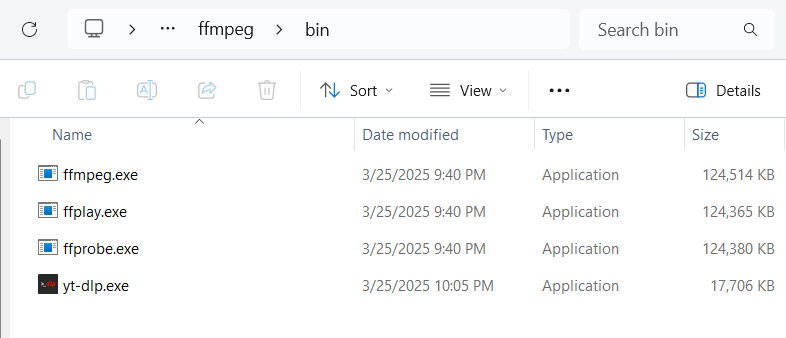

# Working download scripts

## Prerequisites:
    1. Install yt-dlp and FFmpeg
    Ensure you have yt-dlp and ffmpeg installed.
    
    For Windows
    Download yt-dlp.exe:
    👉 https://github.com/yt-dlp/yt-dlp/releases/latest
    
https://github.com/yt-dlp/yt-dlp/releases/download/2025.03.25/yt-dlp.exe
    
    Download FFmpeg (needed for merging audio & video):
    👉 https://github.com/BtbN/FFmpeg-Builds/releases
    
https://github.com/BtbN/FFmpeg-Builds/releases/download/latest/ffmpeg-master-latest-win64-gpl.zip
    
    Get the latest ffmpeg-master-latest-win64-gpl.zip.
    Extract it and copy ffmpeg.exe to the same folder as yt-dlp.exe

## Youtube Video Downloader Scripts:

	1. youtube_main.py  (Main)
	2. youtube3.py  	(Main)
	3. youtube2.py  	(Secondary)

### Single Video:

	python.exe youtube_main.py "https://www.youtube.com/watch?v=TjoNaJ7n4Vg" --quality 480p --output_dir "c:\\download_video"

### Playlist:

	python.exe youtube_main.py "https://www.youtube.com/playlist?list=PLJDwhlqmpSfPUg7_jffHmF_6MooTlH7rO" --quality 720p --output_dir "c:\\download_video"

### Single Video:

	python.exe youtube3.py "https://www.youtube.com/watch?v=gKNf1BFedeM" --output_dir "c:\\download_video" 

### Playlist:

	python.exe youtube3.py "https://www.youtube.com/playlist?list=PLJDwhlqmpSfPUg7_jffHmF_6MooTlH7rO" --output_dir "c:\\download_video"

### Single Video:

	python.exe youtube2.py "https://www.youtube.com/watch?v=gKNf1BFedeM" --output_dir "c:\\download_video" 

### Playlist:

	python.exe youtube2.py "https://www.youtube.com/playlist?list=PLJDwhlqmpSfPUg7_jffHmF_6MooTlH7rO" --output_dir "c:\\download_video"
